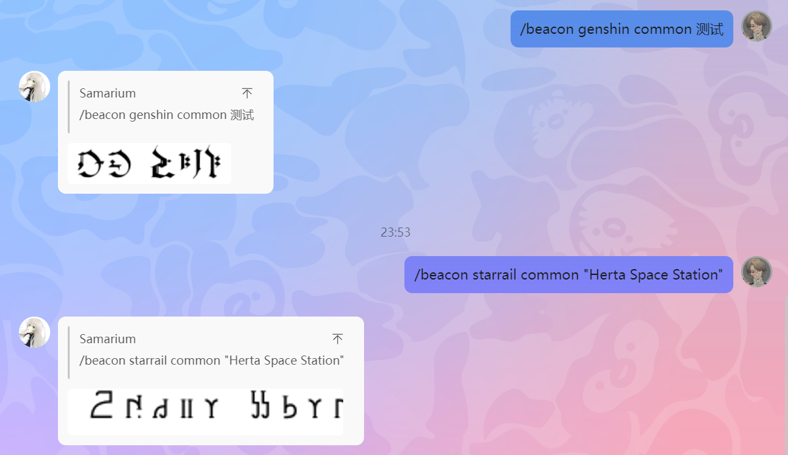

# mirai-console-synesthesia-beacon

将英语字母(拉丁字母)以米哈游的游戏里的架空文字的字体渲染出来的插件

适配 [mirai-console](https://github.com/mamoe/mirai-console) 

[字体文件](src/main/resources/fonts) 来自 [HoYo-Glyphs](https://github.com/SpeedyOrc-C/HoYo-Glyphs)

具体使用文档放在了 [wiki](https://github.com/Samarium150/mirai-console-synesthesia-beacon/wiki) 页面

下图是功能演示

## Miscellaneous

> The thought process of intelligent creatures is mostly represented via inner language,
> just like how people would subconsciously read to themselves when looking at words and form thoughts that way.  
> If we can skip that step of information transmission and instead link up our consciousness,
> convert the codes of our inner language, then let the receiver's language system analyze and restore the information;
> we will have no barriers in communication.  
> &mdash; _Manuscript of Thoughts Regarding the Art of Communication_ by Elias Salas

TL; DR. 玩铁道玩的
